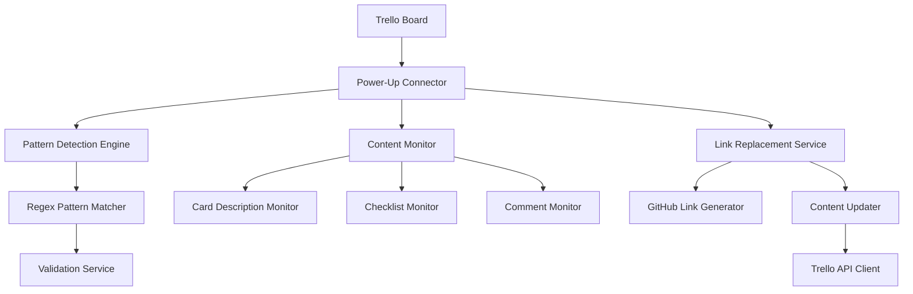

# Design Document: Feedback Link Replacer

## Overview

The Feedback Link Replacer is a Trello Power-Up that automatically detects and replaces feedback reference patterns with GitHub repository links. The system uses Trello's Power-Up framework to monitor card content and perform real-time text replacements when patterns matching "feedback:123123" are detected.

The Power-Up operates as a client-side application served over HTTPS and communicates with Trello through the Power-Up client library. It leverages multiple Trello capabilities to monitor different content areas and provide seamless text replacement functionality.

## Architecture

The system follows Trello's Power-Up architecture pattern with these key components:



### Component Interaction Flow

1. **Content Monitor** continuously watches for changes in card descriptions, checklists, and comments
2. **Pattern Detection Engine** scans content for feedback patterns using regex matching
3. **Link Replacement Service** generates GitHub URLs and updates content through Trello's API
4. **Validation Service** ensures numeric identifiers are valid before replacement

## Components and Interfaces

### Power-Up Connector (`index.html`)
- Serves as the iframe connector for Trello communication
- Loads the Power-Up client library and main application logic
- Handles CORS configuration for Trello.com integration

### Main Application (`client.js`)
- Initializes the Power-Up with required capabilities
- Coordinates between monitoring, detection, and replacement components
- Manages Power-Up lifecycle and error handling

### Pattern Detection Engine
```javascript
interface PatternDetector {
  detectFeedbackPatterns(content: string): FeedbackPattern[]
  validateNumericId(id: string): boolean
}

interface FeedbackPattern {
  originalText: string
  numericId: string
  startIndex: number
  endIndex: number
}
```

### Content Monitor
```javascript
interface ContentMonitor {
  watchCardDescriptions(): void
  watchChecklists(): void
  watchComments(): void
  onContentChange(callback: ContentChangeCallback): void
}

interface ContentChangeCallback {
  (content: string, contentType: ContentType, cardId: string): void
}
```

### Link Replacement Service
```javascript
interface LinkReplacer {
  generateGitHubLink(numericId: string): string
  replacePatterns(content: string, patterns: FeedbackPattern[]): string
  updateCardContent(cardId: string, newContent: string, contentType: ContentType): Promise<void>
}
```

### Trello API Client
```javascript
interface TrelloClient {
  getCardDescription(cardId: string): Promise<string>
  updateCardDescription(cardId: string, description: string): Promise<void>
  getCardChecklists(cardId: string): Promise<Checklist[]>
  updateChecklistItem(checklistId: string, itemId: string, text: string): Promise<void>
  getCardComments(cardId: string): Promise<Comment[]>
  updateComment(commentId: string, text: string): Promise<void>
}
```

## Data Models

### Configuration
```javascript
interface PowerUpConfig {
  name: string
  version: string
  capabilities: string[]
  connectorUrl: string
  corsOrigins: string[]
}
```

### Content Types
```javascript
enum ContentType {
  DESCRIPTION = 'description',
  CHECKLIST_ITEM = 'checklist_item', 
  COMMENT = 'comment'
}
```

### Processing State
```javascript
interface ProcessingState {
  cardId: string
  contentType: ContentType
  isProcessing: boolean
  lastProcessed: Date
  retryCount: number
}
```

## Correctness Properties

Property 1: Feedback pattern replacement
For any card content containing valid feedback patterns (format "feedback:NNNN" where NNNN is numeric), the Power-Up should replace each pattern with the corresponding GitHub link "https://github.com/NNNN"
Validates: Requirements 1.1, 2.1, 2.2, 2.3

Property 2: Multiple pattern replacement
For any content containing multiple feedback patterns, all patterns should be replaced independently while preserving the relative positions of other text
Validates: Requirements 1.2

Property 3: Content preservation invariant
For any content undergoing feedback pattern replacement, all text that is not part of a feedback pattern should remain exactly unchanged
Validates: Requirements 1.3

Property 4: Numeric validation
For any text matching the format "feedback:X" where X contains non-numeric characters, the pattern should be ignored and left unchanged
Validates: Requirements 1.4, 4.4

Property 5: Content monitoring responsiveness
For any card content that is updated with new feedback patterns, the monitoring system should detect and process the new patterns
Validates: Requirements 2.4

Property 6: Invalid pattern preservation
For any malformed feedback patterns (missing colon, empty identifier, etc.), the text should remain unchanged
Validates: Requirements 4.1

## Error Handling

The system implements comprehensive error handling across multiple layers:

### Pattern Validation Errors
- Invalid feedback patterns are silently ignored
- Non-numeric identifiers are rejected during validation
- Malformed patterns (missing colon, empty parts) are left unchanged

### Network and API Errors
- Trello API failures trigger a single retry attempt
- Network timeouts are handled gracefully with fallback behavior
- Rate limiting is respected with exponential backoff

### Processing Errors
- Content parsing errors are logged and don't stop monitoring
- Concurrent update conflicts are resolved using last-write-wins
- Memory constraints are managed through content batching

### Monitoring Errors
- Failed content watches are automatically reestablished
- Power-Up disconnections trigger reconnection attempts
- Board access errors disable monitoring for that board only

## Testing Strategy

The testing approach combines unit tests for specific scenarios with property-based tests for universal correctness guarantees.

### Unit Testing
- Pattern Detection: Test specific feedback pattern formats and edge cases
- Link Generation: Verify correct GitHub URL construction for known inputs
- API Integration: Mock Trello API responses for error conditions
- Content Monitoring: Test event handling for specific content changes
- Error Scenarios: Validate error handling for network failures and invalid data

### Property-Based Testing
The system uses property-based testing to verify universal correctness properties across all possible inputs. Each property test runs a minimum of 100 iterations with randomly generated test data.

Testing Framework: QuickCheck-style property testing library for JavaScript
Test Configuration: 100+ iterations per property, with custom generators for:
- Random card content with embedded feedback patterns
- Various feedback pattern formats (valid and invalid)
- Mixed content types (descriptions, checklists, comments)
- Concurrent content updates and edge cases

Property Test Tags: Each test references its corresponding design property:
- Feature: feedback-link-replacer, Property 1: Feedback pattern replacement
- Feature: feedback-link-replacer, Property 2: Multiple pattern replacement  
- Feature: feedback-link-replacer, Property 3: Content preservation invariant
- Feature: feedback-link-replacer, Property 4: Numeric validation
- Feature: feedback-link-replacer, Property 5: Content monitoring responsiveness
- Feature: feedback-link-replacer, Property 6: Invalid pattern preservation

### Integration Testing
- End-to-end testing with real Trello boards and cards
- Cross-browser compatibility testing for Power-Up functionality
- Performance testing under various content loads
- Multi-user concurrent editing scenarios